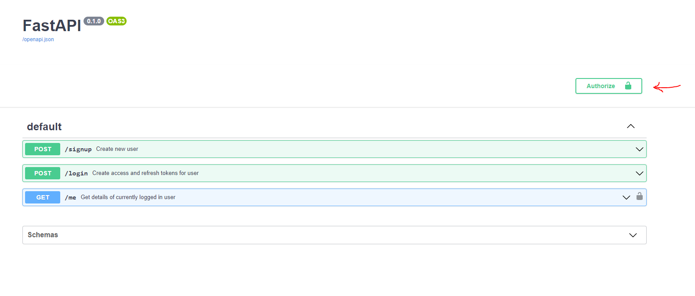
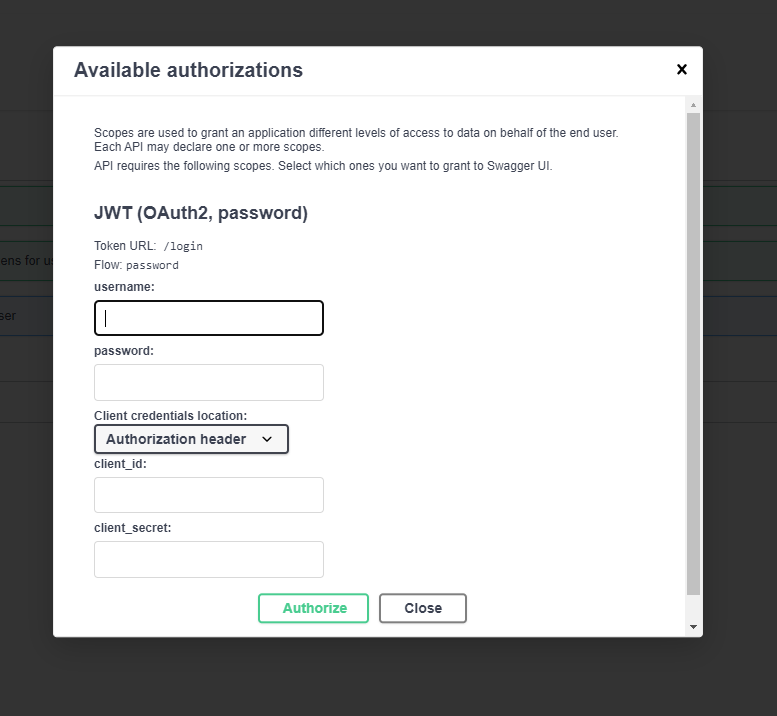

# Project Setup

This guide will help you set up and run the FastAPI project.

## Prerequisites

Make sure the following software is installed on your system:

- **Python 3.11+**
- **PostgreSQL** (For database)
- **Git** (For version control)
- **Docker** (Optional but recommended for running the database in a container)

## Setting Up the Environment

1. **Clone the Repository:**

   ```bash
   git clone <repository-url>
   cd <project-directory>
   ```

2. **Create and Activate Virtual Environment:**

   ```bash
   virtualenv venv
   source venv/bin/activate  # On Windows use `venv\Scripts\activate`

3. **Install Dependencies:**

   Install all required packages listed in the `requirements.txt` file:

   ```bash
   pip install -r requirements.txt
   ```

## Environment Variables

1. Create a `.env` file in the root directory of the project with the following content:

   ```bash
   # PostgreSQL
   ASYNC_DB_ENGINE=             #postgresql+asyncpg
   DB_ENGINE=                   #postgresql
   DB_HOST=
   DB_USERNAME=
   DB_PASSWORD=
   DB_PORT=
   DB_NAME=

   # JWT Configurations
   JWT_SECRET=
   JWT_ALGORITHM=                #HS256
   ACCESS_TOKEN_EXPIRE_MINUTES=
   ```

## Database Setup

1. **Run Alembic Migrations:**

   Apply database migrations using Alembic to set up your database schema:

   ```bash
    cd app && alembic upgrade head
   ```

   This will create the `users` and `tasks` tables as per the migrations.

## Running the Application

You can run the FastAPI application using Uvicorn:

```bash
cd app && uvicorn main:app --reload
```

By default, the app will be available at `http://127.0.0.1:8000`.


# API Usage Guide

Some of the APIs are protected, meaning you need to be authorized before using them. Follow this guide to understand how to use the APIs effectively.

## Authorization for Protected APIs
1. 
    **Sign In to Authorize:**
   - Before accessing protected APIs, you need to sign in. Click the **"Authorize"** button at the top right of the API documentation page.
    

    **Using the Lock Icon for Protected APIs:**
   - Protected APIs have a **lock icon** beside them.

2. **Clicking the Authorize button will open the authorization form with the required fields for login. On a successful response, tokens will be saved and sent to subsequent request in the headers.**

    